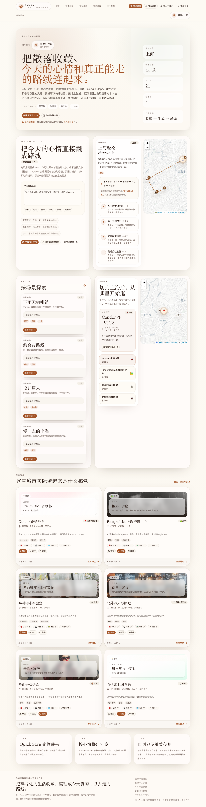
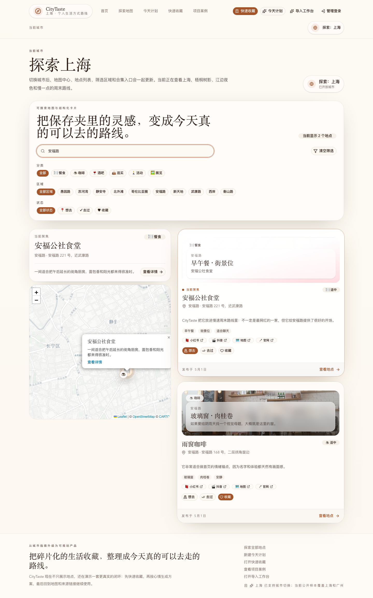
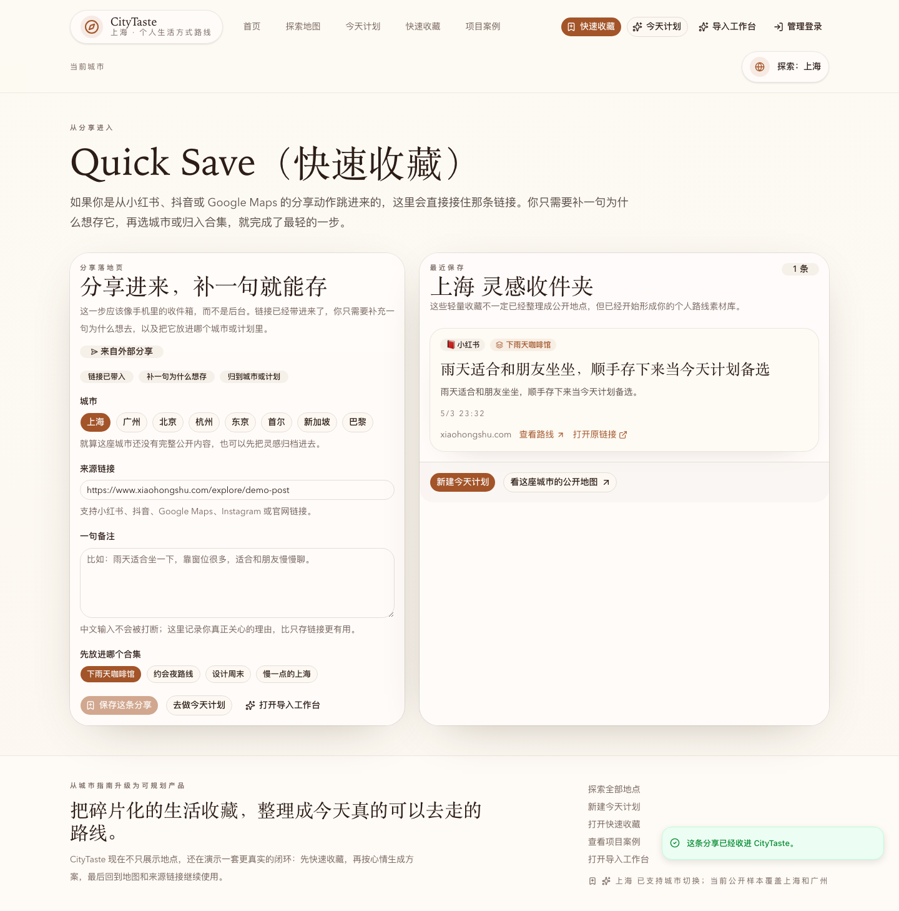
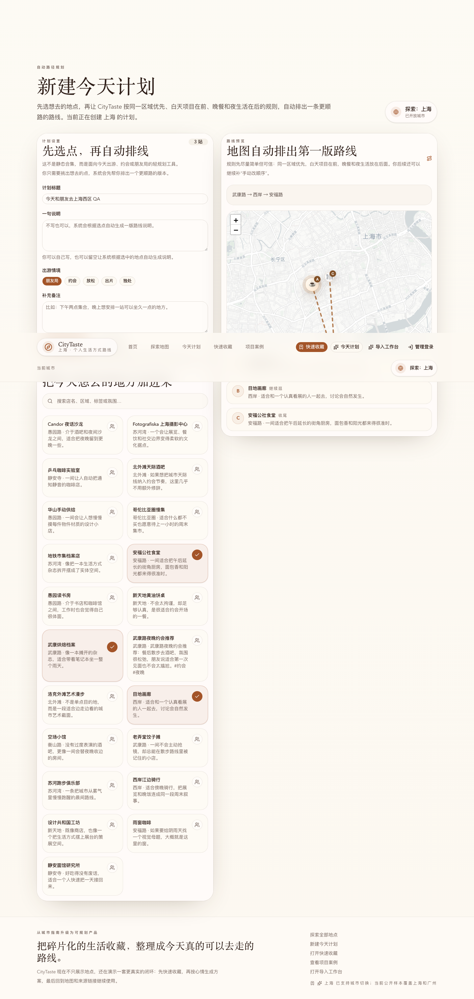
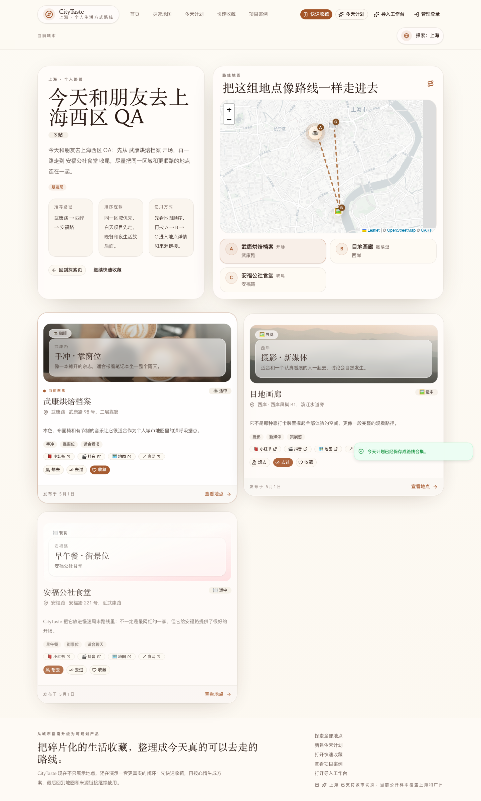
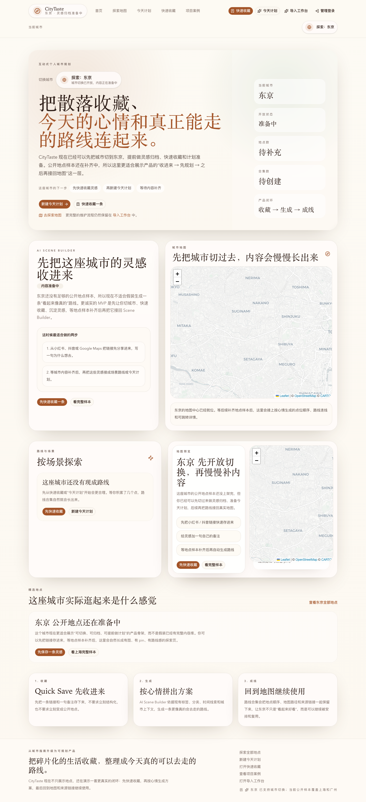

# CityTaste

CityTaste is an interactive personal city guide and lifestyle planning prototype.
It turns scattered inspiration from social posts, maps, chats, and notes into
structured places, editable collections, and usable city routes.

The project is built as a portfolio-first product prototype: the public-facing
experience feels like a polished city guide, while the private studio shows how
new content can enter the system through a lightweight review workflow.



## What This Project Explores

Most city recommendations are saved in messy places: Xiaohongshu posts, Douyin
links, Google Maps pins, chat screenshots, Apple Notes, and half-written travel
plans. CityTaste treats those fragments as inputs to a personal exploration
system instead of leaving them as disconnected bookmarks.

The core product question is:

> How can a person collect lifestyle inspiration casually, then turn it into a
> city map, route, or scene-based plan when they actually want to go out?

CityTaste answers that with three connected layers:

- A public city guide for browsing places, maps, collections, and case-study
  context.
- A daily planning layer for quick saves and route generation.
- A private import studio for turning raw notes into structured review drafts.

## Product Highlights

### Public City Guide

- Editorial home page with city switching, featured places, scene collections,
  and a map preview.
- Explore page with map/list views, search, category filters, area filters, and
  local status filters.
- Place detail pages with tags, vibes, source links, and related context.
- Collection pages that behave like preset exploration routes rather than simple
  category pages.
- Case study page explaining the product decision, data model, and workflow.

### Planning And Personal Use

- Quick Save page for storing a link from Xiaohongshu, Douyin, Google Maps, or
  another source with a short note.
- Plan Builder for selecting places and generating a more coherent route.
- Local visit state for `want_to_go`, `visited`, and `favorite`, stored in the
  browser instead of pretending to be a social network.
- Multi-city structure with Shanghai and Guangzhou populated, plus additional
  city shells for future expansion.

### Private Import Studio

- Owner-only `/studio/import` page for pasting raw text and an optional source
  URL.
- Parser-generated `SubmissionDraft` preview with inferred place fields.
- `/studio/review` desk for editing, approving, or rejecting drafts.
- Approved drafts are materialized as public `Place` records and appear in the
  guide.
- The studio is protected by a lightweight cookie-based owner flow that can later
  be replaced with Supabase Auth.

## Screenshots

| Home | Explore |
| --- | --- |
|  |  |

| Quick Save | Plan Builder |
| --- | --- |
|  |  |

| Collection Route | City Shell |
| --- | --- |
|  |  |

## Main Routes

| Route | Purpose |
| --- | --- |
| `/` | Product story, city switcher, featured places, scene builder, map preview |
| `/explore` | Map and list exploration with search, filters, and local status state |
| `/place/[slug]` | Place detail page with source links and editorial context |
| `/collections/[slug]` | Scene collection or generated route page |
| `/quick-save` | Lightweight link capture flow for everyday use |
| `/plans/new` | Route planning flow based on selected places |
| `/studio/import` | Owner workflow for turning raw text into structured drafts |
| `/studio/review` | Owner workflow for approving or rejecting imported drafts |
| `/case-study` | Product rationale, workflow explanation, and data model |

## Data Flow

CityTaste intentionally separates casual saving, structured review, and public
publishing.

```text
Social/map/chat/note fragment
        |
        v
Quick Save or Import Studio
        |
        v
SubmissionDraft preview
        |
        v
Owner review and correction
        |
        v
Published Place + Source Links
        |
        v
Explore map, place detail page, and collections
```

The demo uses seed data plus a local JSON-backed store at
`.data/citytaste-demo-store.json`. That file is ignored by git so the repository
does not commit local demo state. The data access layer is centralized in
`lib/data.ts`, which makes it easier to swap the demo store for Supabase or
another persistent backend later.

## Core Data Types

The main types live in `lib/types.ts`.

```ts
type Place = {
  id: string
  slug: string
  name: string
  category: "food" | "cafe" | "bar" | "shopping" | "activity" | "exhibition"
  city: string
  area: string
  address: string
  lat: number
  lng: number
  priceLevel: "$" | "$$" | "$$$"
  tags: string[]
  vibes: string[]
  summary: string
  description: string
  sourceLinks: SourceLink[]
  collectionIds: string[]
  publishedAt: string
}

type SubmissionDraft = {
  id: string
  rawText: string
  sourcePlatform: SourcePlatform
  sourceUrl?: string
  parsedPlace: Partial<Place>
  reviewStatus: "pending" | "approved" | "rejected"
  reviewNotes: string
  createdAt: string
}
```

## Tech Stack

- Next.js App Router
- TypeScript
- React
- Tailwind CSS
- shadcn-style local UI primitives
- Leaflet and React Leaflet for maps
- Framer Motion for interaction polish
- Supabase client prepared for future persistence/auth work
- Local JSON demo store for the current prototype

## Local Development

Install dependencies:

```bash
npm install
```

Run the development server:

```bash
npm run dev
```

Open the app:

```text
http://localhost:3000
```

Run lint checks:

```bash
npm run lint
```

Create a production build:

```bash
npm run build
```

## Studio Access

The studio routes are protected by a lightweight owner cookie.

By default, the demo password is:

```text
citytaste-owner
```

For a deployed or shared version, set:

```bash
CITYTASTE_OWNER_PASSWORD=your-own-password
```

Optional Supabase environment variables are already recognized by
`lib/supabase.ts`:

```bash
NEXT_PUBLIC_SUPABASE_URL=...
NEXT_PUBLIC_SUPABASE_ANON_KEY=...
```

The current app does not require Supabase to run. Without Supabase config, the
prototype uses the local demo store.

## Repository Notes

The following are intentionally ignored:

- `node_modules`
- `.next`
- `.data`
- `.env*`
- `citytaste-app`

`citytaste-app` is an old scaffold directory and is not part of the active
application. The active app lives at the repository root.

## Design Direction

CityTaste is not meant to look like a generic restaurant directory or a default
SaaS dashboard. The interface leans toward an editorial travel guide combined
with a practical map product: warm surfaces, large headings, dense but readable
cards, source-aware place details, and route-like collections.

The intended portfolio signal is not only "this is a nice UI". It is:

- Product thinking around messy personal data.
- Information architecture for maps, places, and scenes.
- A realistic content ingestion workflow.
- A front-end implementation that is broad enough to feel like a real product
  while still scoped tightly enough for a polished MVP.
